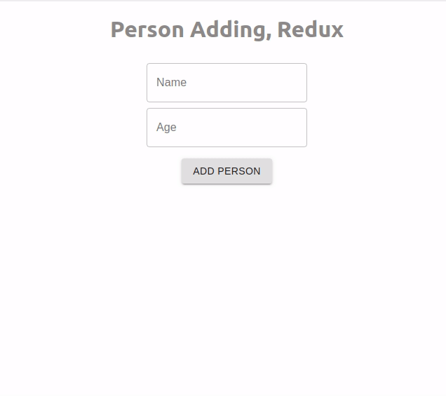

# React Redux APP 

Super sample App for leaning.

# Live 

* [Live Demo](https://person-js.herokuapp.com/)




## Getting Started

These instructions will get you a copy of the project up and running on your local machine for development and testing purposes. See deployment for notes on how to deploy the project on a live system.

### Prerequisites

This project is running under `node`, so make sure you have install.

```
NodeJs
Git
```

### Installing


Copy the below code and past in your terminal

```
git clone git@github.com:lifeeric/react-redux-app.git

cd react-redux-app

```

Install The Dependencies:

```
npm install

   or

yarn install
```


## Running the tests

Test The App is it running right:

```
npm start

or

yarn start
```


## Built With

* [React](http://reactjs.org/) - The web framework used
* [Redux](https://redux.js.org/) - State Management
* [Npm](https://www.npmjs.com/) - Dependency Management


## License

No License

